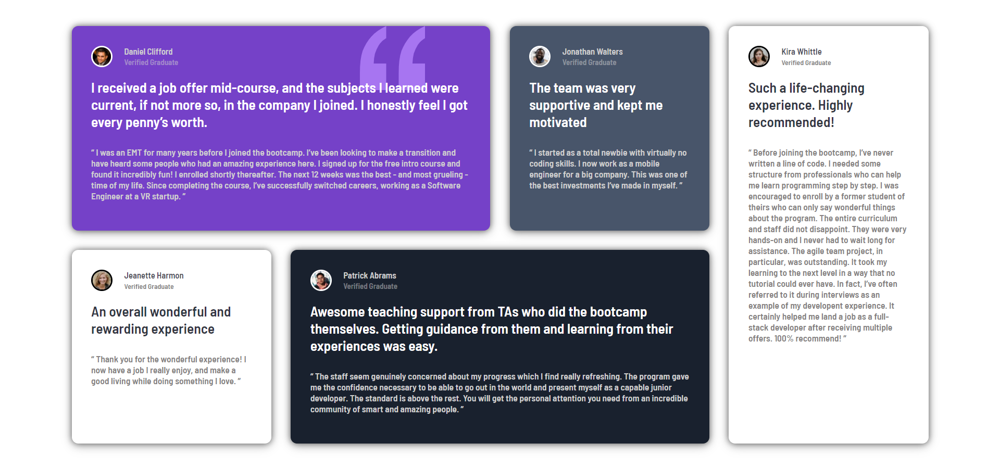

# Frontend Mentor - Testimonials grid section solution

This is a solution to the [Testimonials grid section challenge on Frontend Mentor](https://www.frontendmentor.io/challenges/testimonials-grid-section-Nnw6J7Un7).

## Table of contents

- [Frontend Mentor - Testimonials grid section solution](#frontend-mentor---testimonials-grid-section-solution)
  - [Table of contents](#table-of-contents)
    - [The challenge](#the-challenge)
    - [Screenshot](#screenshot)
    - [Links](#links)
    - [Built with](#built-with)
    - [Useful resources](#useful-resources)
  - [Author](#author)

### The challenge
Users should be able to:

- View the optimal layout for the site depending on their device's screen size

### Screenshot

### Links
- Solution URL: (https://github.com/M0hamedF/Testimonials-grid-section)
- Live Site URL: (https://m0hamedf.github.io/Testimonials-grid-section/)

### Built with
- Semantic HTML5 markup
- CSS
- CSS Grid
- css flex
- Mobile-first workflow

### Useful resources
- [Kevin Powell](https://www.youtube.com/channel/UCJZv4d5rbIKd4QHMPkcABCw) - His channel helped me for the Grid alignment amazing channel overall if you want to learn HTML & CSS.

## Author
- Website - [My Portfolio](https://m0hamedf.github.io/My-Portfolio/)
- Frontend Mentor - [@M0hamedF](https://www.frontendmentor.io/profile/M0hamedF)
